# blender_playground
Blender Python APIの[公式チュートリアル](https://docs.blender.org/api/current/index.html)学習用のリポジトリです。
基本的には公式チュートリアルのコードを写経しているスクリプト置き場です（学習が進んだら独自のコードも入れていく予定です）。

# 対象環境
- Windows10
  - winget
- Blender 2.93
  - python 3.9.2
- VSCode
  - 拡張機能
    - Blender Development
    - pylance
# 環境構築
## 1. Blenderインストール
1. wingetインストール（Microsoft Storeで `アプリインストーラー`をインストール（ `winget`で検索すれば見つかります ））
  
2. Blenderインストール
  1. 適当にシェルを立ち上げます(PowerShellやコマンドプロンプトを立ち上げます( `powershell`, `pwsh`, `cmd`)
    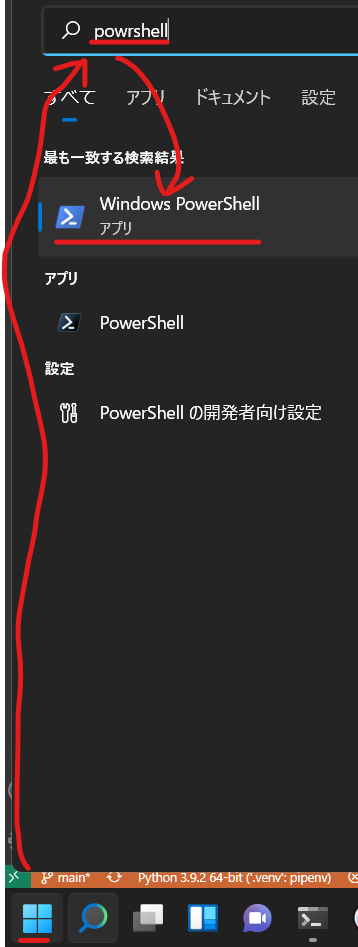
     - インストールするBlenderパッケージに不安を覚える場合のみ下記の確認作業を実施して下さい
         1.  `winget`でBlenderを検索( `winget search Blender` )して公式と思われるもののIDをコピーしておきます
           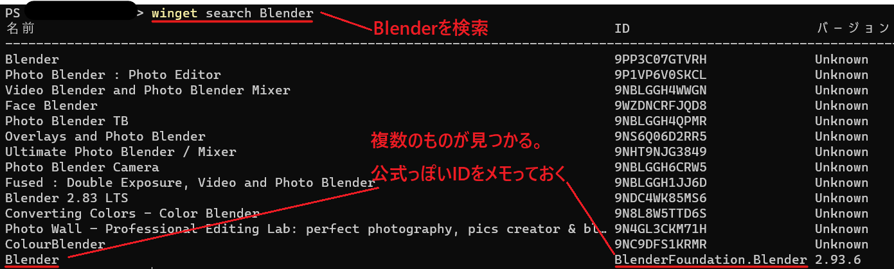
         2. メモったIDの素性を確認します( `winget show メモったID` )
           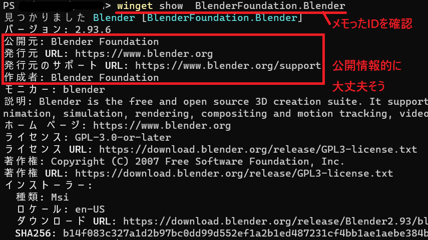
  2. Blenderをインストールします( `winget install BlenderFoundation.Blender` )
     - 確認メッセージが出る場合はYesもしくはAllを答えてください
## 2. VSCodeにBlender編集環境構築
1. VSCodeに拡張機能`Pylance`と`Blennder Development`をインストールします  
    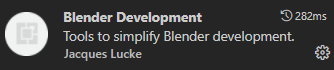  
    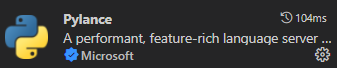
2. `Blender Development`の設定項目`Executables`にBlenderの実行ファイルがある場所を登録します。  
    1. 拡張機能リストから`Blender Development`の設定項目を開きます  
      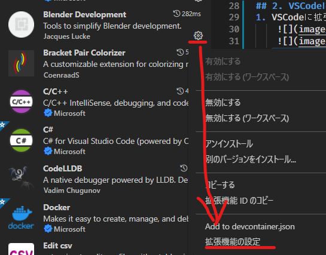  
    2. 設定項目`Executables`を`settings.json`上で表示します  
      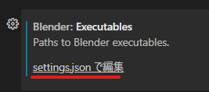
    3. BlenderがインストールされているパスをExplorer等で確認の上、`settings.json`上の`Blender.executables`の`path`に記入します（区切り文字は`\`を2個重ねるか`/`に変えて下さい）
      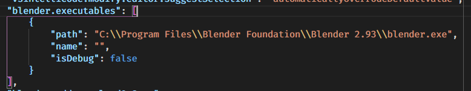
<!-- TODO ★README完成 -->

# アップデート
1. wingetコマンドで更新が存在するか確認します( `winget upgrade` )
   - 更新のあるプログラムが表示されます。  Blendeがある場合は次の手順に進みます
     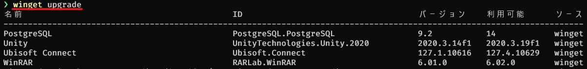
2. Blenderを更新します `winget upgrade --id BlenderFoundation.Blender`
3. 最新のBlenderで使われているpythonバージョンをメモっておきます
   - Blenderを立ち上げ、スクリプトタブのpythonコンソールにて下記のコマンドを実行します
      ```python
      import sys
      sys.version
      ``` 
      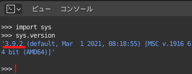
4. VSCode側のダミー環境を更新します
   1. Anacondaの場合
      - 手順3でメモったバージョンで新しい環境を作ります
        - バージョンはマイナーバージョンまで合わせていれば良く、マイクロバージョンを合わせていなくても特に問題ないかと思います
      - 必要なパッケージをインストールしてください（度のパッケージが必要かは `Pipfile` を参照）
   2. `pyenv-win`+`pipenv`の場合
      1. メモったバージョンのpythonが入っているかチェックします `pyenv versions`  
         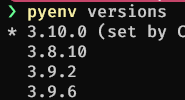
         - 入っていない場合は追加でインストールします `pyenv install メモッたバージョン`
      2. 本リポジトリのトップフォルダに移動して使用するpythonバージョンを指定します
         - `pyenv local メモッたバージョン`
         - ファイル`.python-version`に指定したバージョンが記載されていれば成功です  
           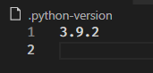
      3. `Pipfile`内の `python_version` をメモったバージョンに変えます  
         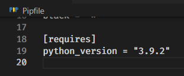
      4. 環境を更新します `pipenv install --dev` 
5. VSCode拡張機能`Blender Development`の設定を更新します
    1. 拡張機能リストから`Blender Development`の設定項目を開きます  
        
    2. 設定項目`Executables`を`settings.json`上で表示します  
      
    3. BlenderがインストールされているパスをExplorer等で確認の上、`settings.json`上の`Blender.executables`の`path`に記入します（区切り文字は`\`を2個重ねるか`/`に変えて下さい）
      
