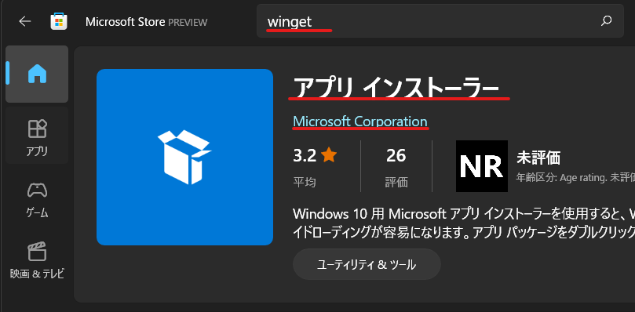

# blender_playground
Blender Python APIの[公式チュートリアル](https://docs.blender.org/api/current/index.html)学習用のリポジトリです。
基本的には公式チュートリアルのコードを写経しているスクリプト置き場です（学習が進んだら独自のコードも入れていく予定です）。

# 対象環境
- Windows10
  - winget
- Blender 2.93
  - python 3.9.2
- VSCode
  - 拡張機能
    - Blender Development
    - pylance
# 環境構築
1. Blenderをインストールしてください（wingetによるインストール推奨）
   1. wingetインストール（Microsoft Storeで `アプリインストーラー`をインストール（ `winget`で検索すれば見つかります ））
      
   2. Blenderインストール
      1. 適当にシェルを立ち上げます(PowerShellやコマンドプロンプトを立ち上げます( `powershell`, `pwsh`, `cmd`)
        
         - インストールするBlenderパッケージに不安を覚える場合のみ下記の確認作業を実施して下さい
             1.  `winget`でBlenderを検索( `winget search Blender` )して公式と思われるもののIDをコピーしておきます
               
             2. メモったIDの素性を確認します( `winget show メモったID` )
               
      2. Blenderをインストールします( `winget install BlenderFoundation.Blender` )
         - 確認メッセージが出る場合はYesもしくはAllを答えてください
2. VSCodeにBlender
  <!-- TODO ★README完成 -->